# Cryptic Codex Format

The pages are generated from JSON, the text can be formatted with all of Minecraft [Formatting codes](https://minecraft.wiki/w/Formatting_codes).

## Entry JSON Structure

*JSON don't support comments, the comments below are for explanation purposes only.*

```jsonc
{
  // unique id for the page
  "id": "cryptic_eye", 
  // bestiary, lore, spells, trinkets
  "category": "trinkets",
  // page title
  "title": "Cryptic Eye", 
  // page subtitle
  "subtitle": "A watchful companion", 
  // page icon path
  "icon": "textures/item/cryptic_eye_2d.png", 
  // NOT YET IMPLEMENTED
  // condition to unlock the page, can be ALWAYS, HAS_<item_id>, KILLED_<entity_id>
  "unlock_condition": "ALWAYS", 
  "pages": [
    {
      // just show text and nothing else
      "type": "text",
      // text
      "content": "§6Defeating a Guardian§r\n\nWhen slain, the Guardian drops its §5Head§r, which can be crafted into the powerful §5Eternal Guardian Mask§r.\n\n§7Warning: Guardians are formidable opponents. Prepare accordingly.§r"
    },
    {
      // show the model (GUI version) of an item with description
      "type": "item_showcase", 
      // item id to showcase
      "item": "crawlingmysteries:cryptic_eye",
      // additional text
      "content": "A mysterious eye that seems to have chosen you as its bearer. It watches over you with an intelligence that feels... ancient."
    },
    {
      // show spell info with icon
      "type": "spell_info",
      // spell id
      // show cooldown, item source, description 
      "spell": "feed_totem", 
      // additional text
      "content": "Requires a Totem of Undying in your inventory to activate." 
    },
    {
      // show an image with description
      "type": "image", 
      // image path
      "image": "textures/gui/codex/image/origins_illustration.png",
      // additional text
      "content": "Ancient symbols found throughout the Deep Dark"
    },
    {
      // show crafting recipe with description
      "type": "crafting", 
      // crafting recipe, created in a 3x3 grid:
      // result;row1_col1,row1_col2,row1_col3,row2_col1,row2_col2,row2_col3,row3_col1,row3_col2,row3_col3
      // use _ for empty slots
      "recipe": "crawlingmysteries:eternal_guardian_mask;_,_,_,minecraft:leather,crawlingmysteries:eternal_guardian_head,minecraft:leather,_,_,_",
      // additional text
      "content": "Craft the mask by adding two leather pieces to the sides of the §5Eternal Guardian's Head§r."
    },
    {
      // show an entity with description
      "type": "entity_display",
      // entity id to display
      // show interactive 3D model, max health & armor
      "entity": "crawlingmysteries:eternal_guardian",
      // additional text
      "content": "The §cEternal Guardian§r is a spectral entity summoned to protect fallen warriors' belongings. They are bound to the §5Eternal Guardian's Band§r and will attack anyone who approaches the tombstone they guard."
    }
  ]
}
```

## Screenshots

The glorious **Cryptic Codex**:  
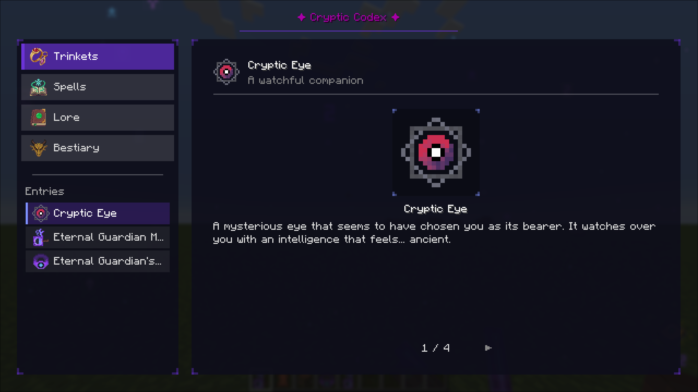

## Left Panel

The left panel shows the categories and entries:  
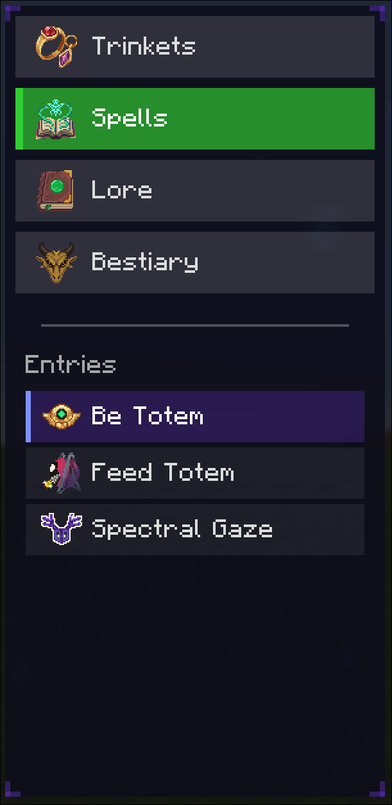

There are 4 categories: Bestiary, Lore, Spells, and Trinkets.
The categories are color-coded and iconified.

## Right Panel

The right panel shows the content of the selected entry:  
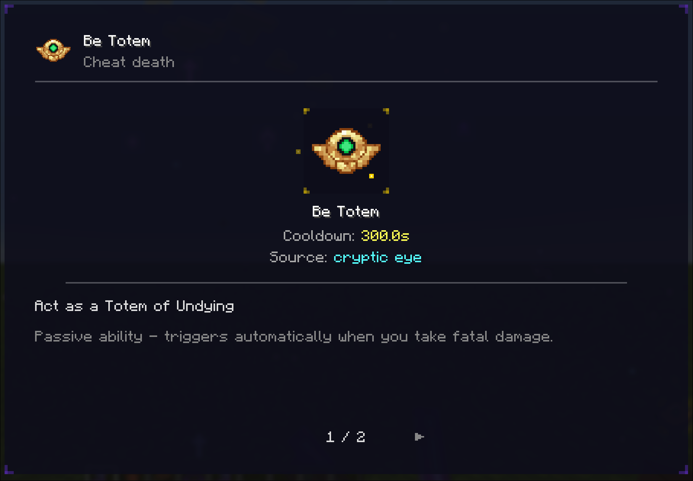

Each page is scrollable if its content exceeds the visible area.  
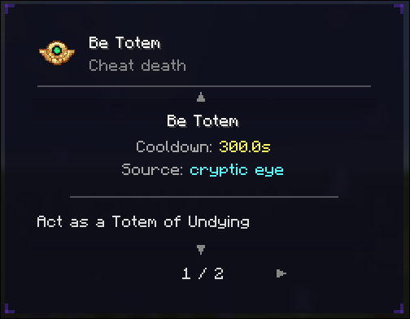

What the "title", "subtitle" and "icon" fields look like:  
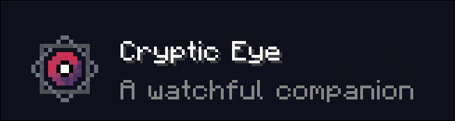

### Page Types

#### Text Page

A simple text page:  
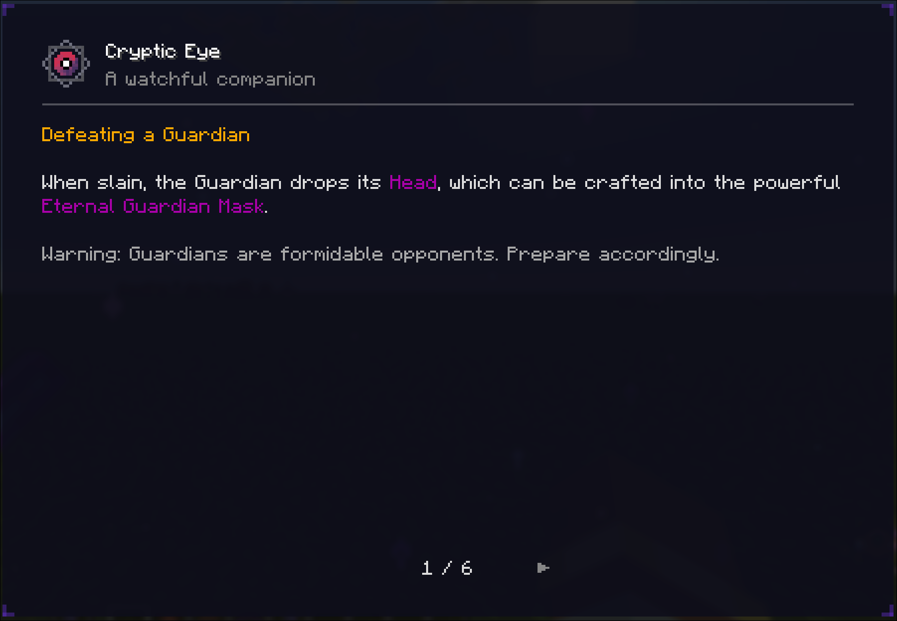

The text supports Minecraft formatting codes for colors and styles (e.g., §6 for gold color, §r to reset).

#### Item Showcase Page

The model displayed is the GUI version of the item:  
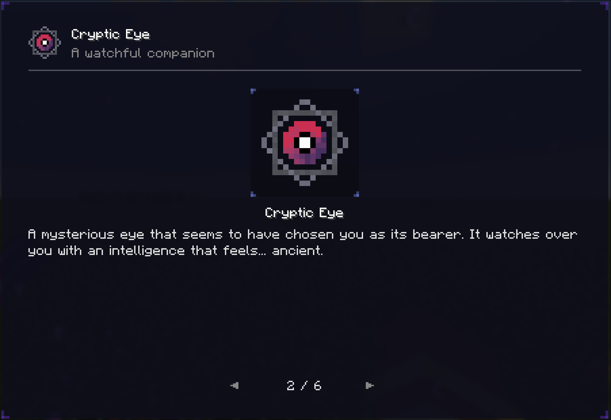

#### Spell Info Page

The spell info page shows the spell icon, cooldown, source item, description and additional text:  
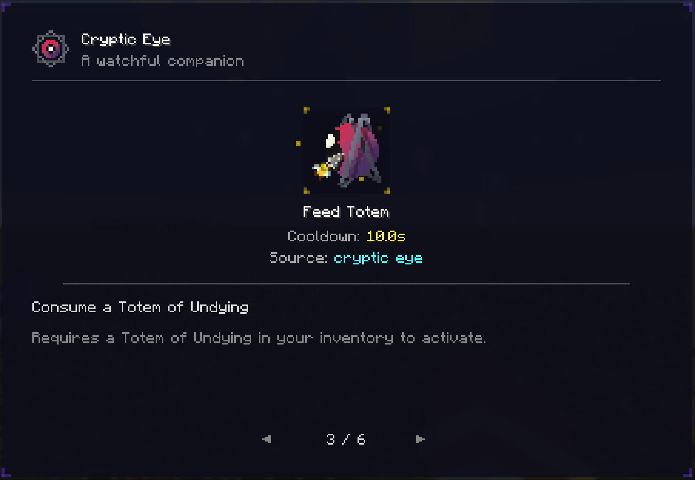

#### Image Page

An image page displays an image along with additional text:  
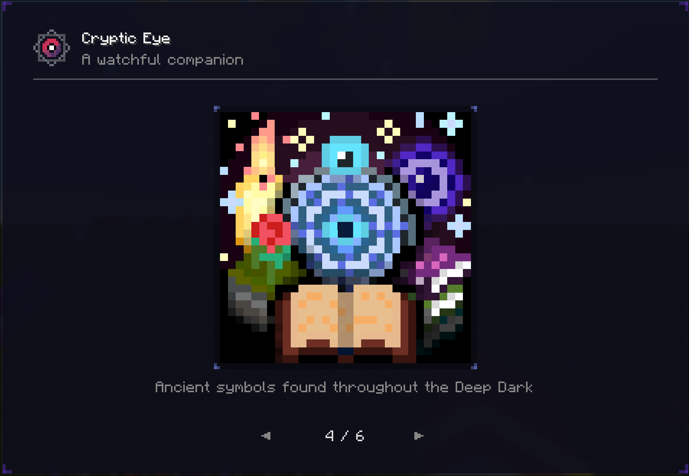

#### Crafting Page

A crafting page shows a 3x3 crafting recipe grid along with additional text:  
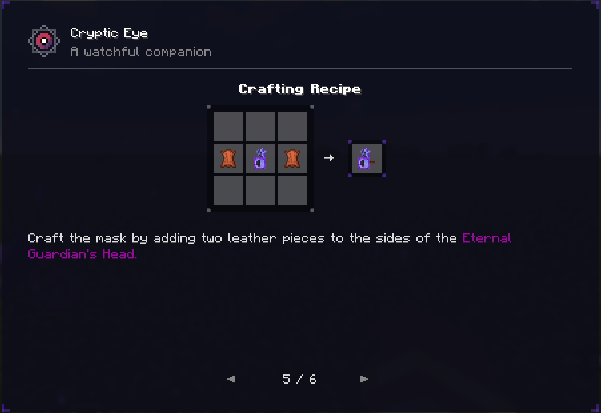

#### Entity Display Page

The entity display page shows an interactive 3D model of the entity along with its max health, armor, and additional text:  
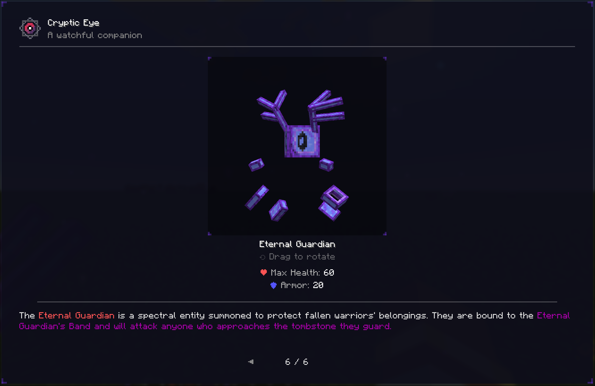  
*The GUI scale is 3 instead of 4 for this image to fit the whole of the page.*
